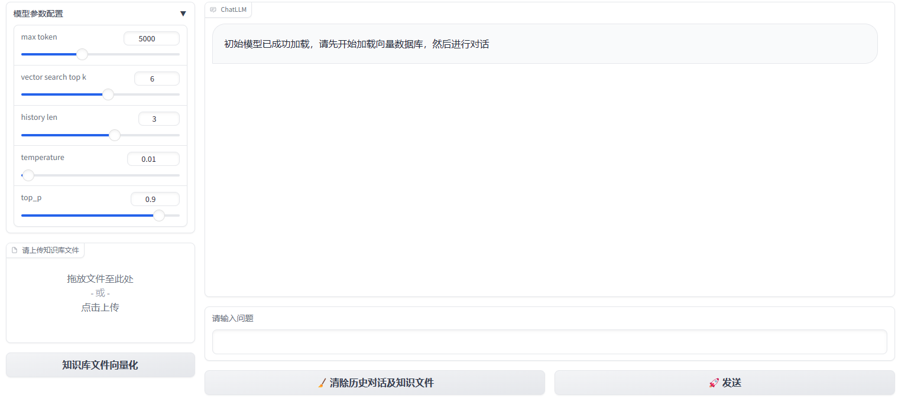
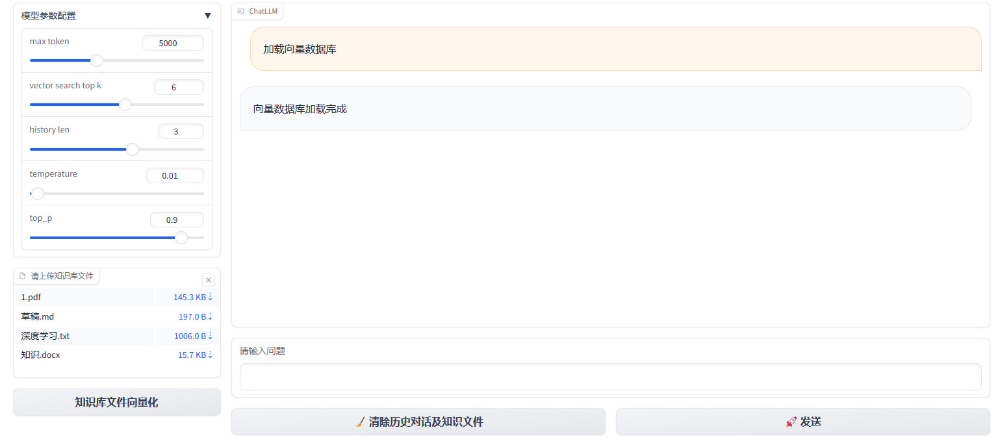

# langchain_chatglm2-6b_Chromadb

可参考网址

[🔑 Getting Started | Chroma (trychroma.com)](https://docs.trychroma.com/getting-started)

[Client | Chroma (trychroma.com)](https://docs.trychroma.com/reference/Client)

[Chroma向量数据库使用教程 - 知乎 (zhihu.com)](https://zhuanlan.zhihu.com/p/658217843)

[Client | Chroma (trychroma.com)](https://docs.trychroma.com/reference/Client)

[Client | Chroma (trychroma.com)](https://docs.trychroma.com/reference/Client)

-----

- 这里采用的chromadb==0.4.10
- 因为当chromdb>=0.4.16的时候为了支持多模态，这里修改了
  ```python
    from chromadb import Documents, EmbeddingFunction, Embeddings
  
    class MyEmbeddingFunction(EmbeddingFunction):
        def __call__(self, texts: Documents) -> Embeddings:
            # embed the documents somehow
            return embeddings
  ```


------

[ValueError: Expected metadata value to be a str, int, or float, got [{'text': 'Git', 'url': '#git'}\] which is a  when storing into Chroma vector stores using using element mode of UnstructuredMarkdownLoader · Issue #8556 · langchain-ai/langchain (github.com)](https://github.com/langchain-ai/langchain/issues/8556)

报错：`ValueError: Expected metadata value to be a str, int, float or bool, got ['zho'] which is a <class 'list'>`

通过观察是：`UnstructuredFileLoader(filepath,mode="elements")`中的参数`mode="elements"`

- 有`mode="elements"`

  ```markdown
  [Document(page_content='“机器学习是让计算机像人类一样学习和行动的科学，通过以观察和现实世界互动的形式向他们提供数据和信息，以自主的方式改善他们的学习。”', metadata={'source': '/tmp/gradio/1152842a4af264b2c7ba1d8410ca299a625418e5/草稿.md', 'filename': '草稿.md', 'file_directory': '/tmp/gradio/1152842a4af264b2c7ba1d8410ca299a625418e5', 'last_modified': '2023-11-04T10:24:22', 'filetype': 'text/markdown', **'languages': ['zho']**, 'page_number': 1, 'category': 'Title'})]
  
  ```

  其中`metadata={'source': '/tmp/gradio/1152842a4af264b2c7ba1d8410ca299a625418e5/草稿.md', 'filename': '草稿.md', 'file_directory': '/tmp/gradio/1152842a4af264b2c7ba1d8410ca299a625418e5', 'last_modified': '2023-11-04T10:24:22', 'filetype': 'text/markdown', 'languages': ['zho'], 'page_number': 1, 'category': 'Title'}`很详细

  - 但是在chromadb中是无法识别list中的`'languages': ['zho']`这里就会报错
  - 但是Faiss中间是这样用的，说明Faiss可以处理这样的数据

- 无`mode="elements"`

  ```markdown
  
  [Document(page_content='“机器学习是让计算机像人类一样学习和行动的科学，通过以观察和现实世界互动的形式向他们提供数据和信息，以自主的方式改善他们的学习。”', metadata={'source': '../knowledge/草稿.md'})]
  
  ```

  指挥显示文件的source

- 可以用try文件夹下的try_chroma.py进行检验

----

为了能让向量书库加载完成时能在对话框中有所显示，提示使用者可以进行对话了

修改代码如下：

```python
# 模型初始函数
# 要求：先成功加载模型，加载成功后然后进行向量数据库的加载，两者都加载完后才能进行对话
def init_model():
    try:
        knowladge_based_chat_llm.init_model_config()
        knowladge_based_chat_llm.llm._call("你好")
        return "初始模型已成功加载，请先开始加载向量数据库，然后进行对话" 
    except Exception as e:
        return "模型未成功重新加载，请点击重新加载模型"

# 向量数据库的加载
def init_vector_store(file_obj):
    # 这里用try except来写
    # state='向量数据库加载完成'
    # return [('加载向量数据库',state)]
    try:
        knowladge_based_chat_llm.init_knowledge_vector_store(file_obj)
        print('向量数据库加载完成')
        return [('加载向量数据库','向量数据库加载完成')]
    # state='向量数据库加载完成'
    except Exception as e:
        print('向量数据库加载失败')
        return [('加载向量数据库','向量数据库加载失败')]

# 在outputs中添加chatbot->[chatbot]，而不是[]
init_vs.click(
    init_vector_store,
    show_progress=True,
    inputs=[file],
    outputs=[chatbot],
            )
```







